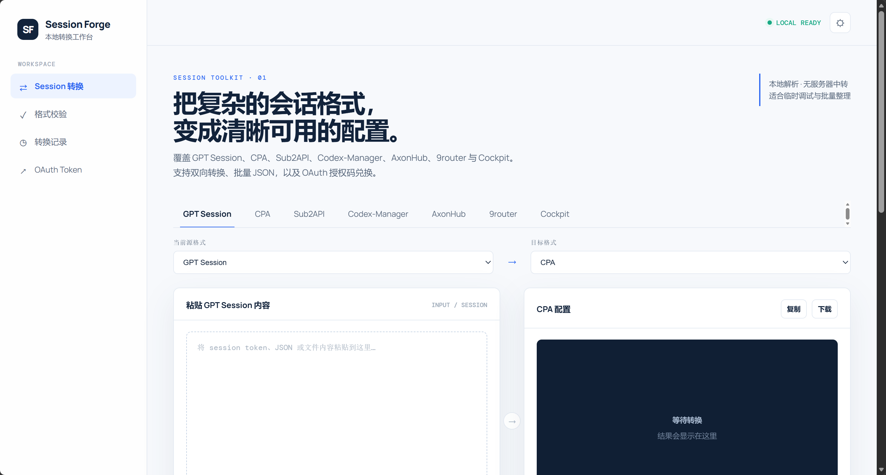
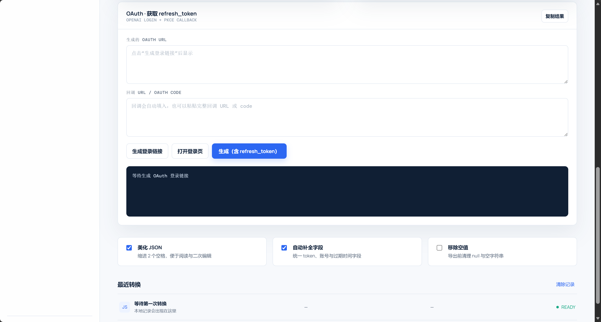

# GPTSession Convert

一个浏览器本地运行的凭证归一化与格式转换工具，支持 OpenAI/GPT Session、Grok/xAI、CPA、Sub2API、Codex-Manager、Codex CLI、Codex2API、Grok CLI、Grok2API，以及 AxonHub、9router 和 Cockpit 之间的转换，并提供 OpenAI OAuth 登录、回调和 `refresh_token` 生成流程。



## 功能

- GPT Session / OpenAI 凭证转换为 CPA、Sub2API、Codex-Manager、Codex CLI、Codex2API、AxonHub、9router、Cockpit
- Grok / xAI 凭证转换为 CPA、Sub2API、Grok CLI、Grok2API、AxonHub、9router、Cockpit
- CPA、Sub2API、Codex、Grok 及自定义格式之间互转
- 支持单条 JSON、JSON 数组、JSONL 和批量账号
- 输入区支持粘贴 OpenAI / Grok OAuth JSON、JSONL，并提供获取 ChatGPT Session 的快捷入口
- 支持拖拽任意扩展名的凭据文件
- 支持选择多个凭据文件
- 支持选择本地目录递归导入凭据
- 支持 ZIP 凭据包导入（Store / Deflate）并校验 CRC
- 支持复制结果和下载 JSON、JSONL 或 ZIP 批量归档
- 内置 OpenAI RS256 与 xAI ES256 JWKS 快照，可离线验证 JWT 签名、发行方和受众
- 默认拦截签名无效、算法不允许、发行方不匹配等明确伪造的 Token
- 按 provider 和 access/refresh/session/id token 去重；冲突 token 不会被合并
- 最近转换记录按每次实际的源格式和目标格式保存
- 输出支持 `accounts`、`tokens/meta`、Codex `auth.json`、Grok CLI map 等真实结构
- OAuth PKCE 登录流程
- 自动接收 `http://localhost:1455/auth/callback`
- 生成包含 `refresh_token` 的目标格式配置

## Docker 部署

需要先安装 Docker Desktop。

在项目目录执行：

```powershell
cd GPTSession_convert
docker compose up -d --build
```

查看容器状态：

```powershell
docker compose ps
```

查看日志：

```powershell
docker compose logs -f
```

浏览器访问：

```text
http://localhost:1455/
```

停止容器：

```powershell
docker compose down
```

更新代码后重新构建：

```powershell
docker compose up -d --build
```

## Node.js 手动启动

需要 Node.js 18 或更高版本。

```powershell
cd GPTSession_convert
node server.js
```

然后访问：

```text
http://localhost:1455/
```

## 直接打开静态页面

直接打开 `index.html` 可以使用格式转换、文件导入、复制和下载功能。

OAuth 功能建议通过 `http://localhost:1455/` 使用，因为 OAuth 回调地址固定为：

```text
http://localhost:1455/auth/callback
```

ZIP 导入依赖现代浏览器的 DecompressionStream，建议使用最新版 Chrome 或 Edge。JWKS 快照已经内置在页面中，验签不会联网拉取公钥。

## 端口配置

默认端口为 `1455`。Docker 部署时可以修改 `docker-compose.yml` 中的端口映射；如果修改了宿主机端口，OAuth 回调仍需要保持 `localhost:1455`，否则需要同步调整 OAuth Client 配置和页面中的回调地址。

## 安全说明

- Session、JSON 和转换结果默认在浏览器本地处理。
- JWT 验签只使用页面内置的 2026-07-17 JWKS 快照；快照轮换后应重新发布页面。
- OAuth 兑换由本地 `server.js` 代理到 OpenAI Token Endpoint。
- 本项目不包含数据库，不会主动保存账号和 token。
- 不建议把当前 OAuth 配置直接部署到公网环境。
